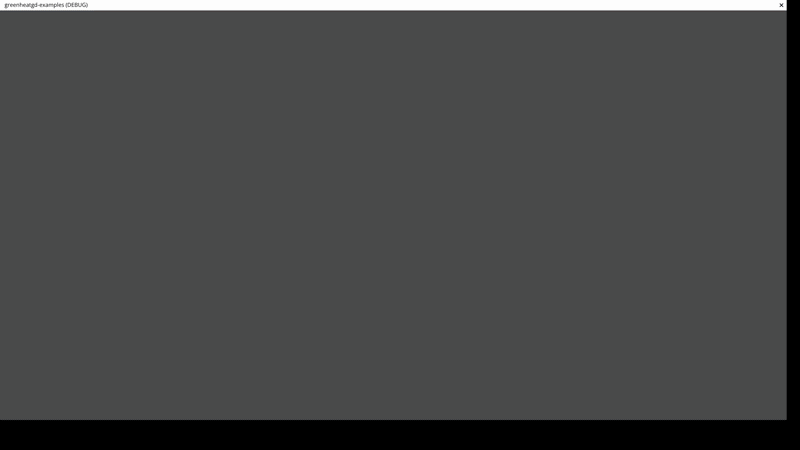
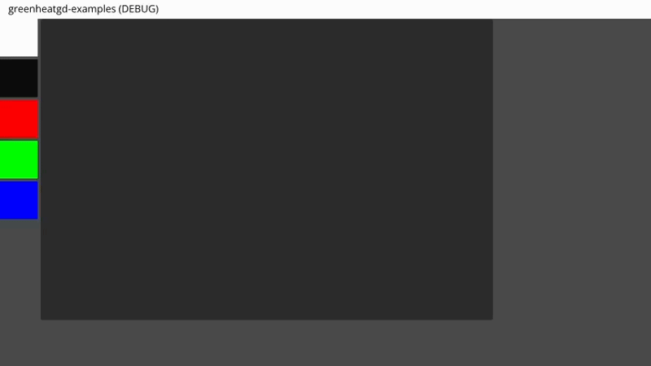
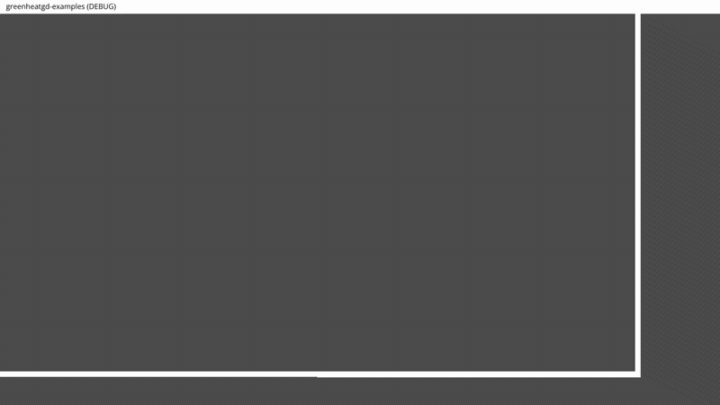
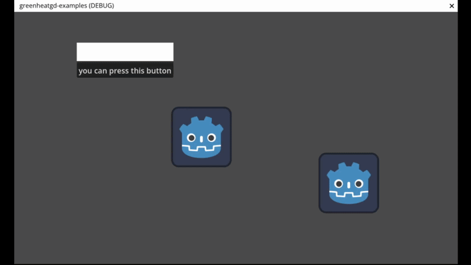

# Green Heat Examples
This repository contains examples of how to use the Green Heat twitch extension with the Godot Engine. 

## Godot GreenHeat plugin
The Godot GreenHeat plugin allows users to easily integrate the extension inside the streamer's overlay. You can find the plugin in [it's own repository](https://github.com/CrazyKitty357/greenheatgd)

# Examples
Here are some examples of what you can do using the extension to interact with the viewers.

## Cursors
The cursor example is the easiest one. It simply displays a cursor on the screen where the viewer's mouse is. I made this one fancy by adding a trail effect and rotation when the cursor goes sideways.

## Canvas
The canvas example shows you how you can have a simple canvas where your viewers can draw and choose their color.

## Heat Map
The heat map example shows you how to create a "heat map" of where the viewers are clicking on the screen.

## Physics
The physics shows how you can turn the viewer's drawing into real 2D physics objects that can interact with each other. (I know this physics looks weird and I don't know why 🤷)

## Draggable Objects
The draggable objects example shows how you can make objects that viewers can drag around the screen.

# Propositions
I am welcome to any propositions of new examples or improvements to the existing ones. You can contact me on Bluesky at [@venorrak.dev](https://bsky.app/profile/venorrak.dev) or open an issue in this repository.